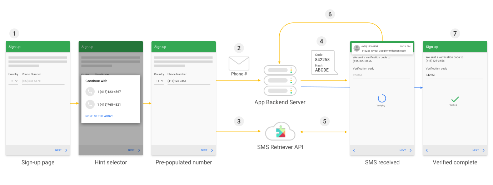

# Automatic SMS Verification with the SMS Retriever API
This sample code is in JAVA, As per Google's new policy with the SMS Retriever API, you can perform SMS-based user verification in your Android app automatically, without requiring the user to manually type verification codes, and without requiring any extra app permissions.  

## Warning as per the new policy
- Google restricts which Android apps can request Call Log and SMS permissions 
- Only apps selected as the device's default app for making calls or sending text messages will be able to access call logs and SMS data from now on.

## Alert - this app will be impacted by a policy change. This app will be impacted by a change in the Google Play policy governing the use of SMS and CALL_LOG permissions. Apps that are not compliant may be removed from Google Play on Jan 9th, 2019.

## Solution

## Info

## Work flow

- Enter or pick mobile number from smart lock hint selector and initiate SMS verification call to your server.
- App request your server to verify the entered mobile number.
- Your app calls the SMS Retriever API at the same time and listening for an SMS from your server.
- Your server sends an SMS message that includes a verification code and a hash to identify your app.
- When user's device receives the SMS message, SMS Retriever API reads the SMS in your app.
- App extract verification code from SMS and sends to your server for code verification.
- Your server receives the verification code and after validating it can return success response to proceed.

## Prerequisites
The SMS Retriever API is available only on Android devices with Play services version 10.2 and newer.

## Important
The standard SMS format is given blow.

    <#> Your ExampleApp code is: 123ABC78 
    FA+9qCX9VSu

SMS alwayse starts with <#> sign and have a hash key FA+9qCX9VSu to identify your app it is generated with your app's package id. You just need to get this has key from app and share with your server. 
In next few steps you will see how to create hash keys.

### Dependencies used
    // Add at app level gradle file
        implementation 'androidx.appcompat:appcompat:1.1.0'
       implementation 'com.google.android.gms:play-services-base:17.1.0'
       implementation 'com.google.android.gms:play-services-identity:17.0.0'
       implementation 'com.google.android.gms:play-services-auth:17.0.0'
       implementation 'com.google.android.gms:play-services-auth-api-phone:17.1.0'

     // Note: If you have migrated your code to AndroidX than add this for LocalBroadCastManager
         implementation 'androidx.localbroadcastmanager:localbroadcastmanager:1.0.0'

    // Add at project level gradle file
    classpath 'com.google.gms:google-services:4.2.0'

    
## Integration steps
1. AppSignatureHashHelper class is responsible to get Hash key associated with your app as per your packege id. This is only one time required to get your app's hash key it would alwayse be same unless you are changing app's package id.
       
       // Inside Main Activity 
       Log.d(TAG, "Apps Hash Key: " + appSignatureHashHelper.getAppSignatures().get(0));
       // Inside  log cat Apps Hash Key: qzwS5M4KQ5H
        
                
2. Declare this SMSReceiver in your app's manifest file in side application tag.

        <receiver
            android:name=".SMSReceiver"
            android:exported="true">
            <intent-filter>
                <action android:name="com.google.android.gms.auth.api.phone.SMS_RETRIEVED" />
            </intent-filter>
        </receiver> 
3. Create SMSReceiver class that will listen SMS and extract code and create OTPReceiveListener that will communicate with Activities/Fragments.
      
       public interface OTPReceiveListener {
           void onOTPReceived(String otp);
           void onOTPTimeOut();
           void onOTPReceivedError(String error);
           }
       }
4.  Create SMSReceiver listenrs and Intitiate SmsRetrieverClient. 

        private void startSMSListener() {
        try {
            smsReceiver = new SMSReceiver();
            smsReceiver.setOTPListener(this);

            IntentFilter intentFilter = new IntentFilter();
            intentFilter.addAction(SmsRetriever.SMS_RETRIEVED_ACTION);
            this.registerReceiver(smsReceiver, intentFilter);

            SmsRetrieverClient client = SmsRetriever.getClient(this);
            Task<Void> task = client.startSmsRetriever();
            task.addOnSuccessListener(new OnSuccessListener<Void>() {
                @Override
                public void onSuccess(Void aVoid) {
                    // API successfully started
                }
            });
            task.addOnFailureListener(new OnFailureListener() {
                @Override
                public void onFailure(@NonNull Exception e) {
                    // Fail to start API
                }
            });
        } catch (Exception e) {
            e.printStackTrace();
          }
        }
5. You will receive OTP in call back methods implemented in you  Activity/Fragment.
    
       @Override
       public void onOTPReceived(String otp) {
       }

       @Override
       public void onOTPTimeOut() {
       }

       @Override
       public void onOTPReceivedError(String error) {
       }

## Obtain User's Phone Number From Smart lock hint slector
    // Construct a request for phone numbers and show the picker
    private void requestHint() {
    HintRequest hintRequest = new HintRequest.Builder()
           .setPhoneNumberIdentifierSupported(true)
           .build();

    PendingIntent intent = Auth.CredentialsApi.getHintPickerIntent(
            apiClient, hintRequest);
    startIntentSenderForResult(intent.getIntentSender(),
            RESOLVE_HINT, null, 0, 0, 0);
    }

    // Obtain the phone number from the result
    @Override
    public void onActivityResult(int requestCode, int resultCode, Intent data) {
           super.onActivityResult(requestCode, resultCode, data);
          if (requestCode == RESOLVE_HINT) {
          if (resultCode == RESULT_OK) {
          Credential credential = data.getParcelableExtra(Credential.EXTRA_KEY);
          // credential.getId();  <-- will need to process phone number string
         }
       }
    }

## How to run a sample
 Clone or download the project open it with Android Studio compile and run it will work.

### Server Side Implementation / SMS Guide
[Google's official doc](https://developers.google.com/identity/sms-retriever/verify)

## Author
[Waheed Nazir](https://www.linkedin.com/in/waheed-nazir-36521579/ "Waheed Nazir (WaveTechStudio)")

## License
It is totally free to use. :)

## Credits
[Google's official doc](https://developers.google.com/identity/sms-retriever/overview) , 
[Chintan Desai's (Repo/Kotlin)](https://github.com/chintandesai49/SMSRetrieverAPIDemo) 
